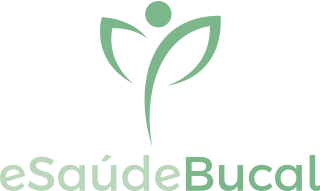

O eSaudeBucal é um sistema de informação em saúde bucal no escopo da atenção primária.

> ORIENTAÇÂO: onde aplicável o conteúdo da ISO 13940 deve ser utilizado, conforme ilustrado no portal [ContSys](https://contsys.org/).

### O que possui de especial?
- Um conjunto sólido dos conceitos em saúde bucal considerados "relevantes" para uma atenção de qualidade.
- Preparação tanto para enviar quanto para receber informações de outros sistemas (interoperabilidade).
- A experiência do usuário foi tratada como elemento de grande relevância, desde o primeiro instante.
- Faz uso das melhores práticas para construção de software.

### Objetivos
- Produzir uma solução que satisfaz padrões de interoperabilidade adotados pelo Brasil e aderente à Política Goiana de Informação e Informática em Saúde. 
- Fortalecer no Estado de Goiás a produção de software de qualidade para a área da saúde.

### Realização
Universidade Federal de Goiás (UFG). 

