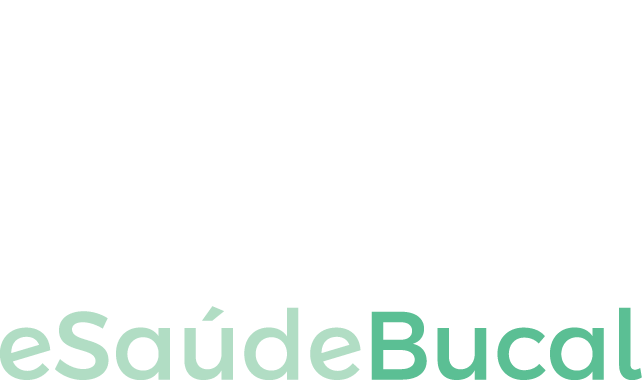

O eSaudeBucal é um sistema de informação em saúde que se concentra nas necessidades de informação da atenção primária no escopo da saúde bucal.

### Objetivos
- Produzir uma solução que satisfaz padrões de interoperabilidade adotados pelo Brasil e aderente à Política Goiana de Informação e Informática em Saúde. 
- Fortalecer no Estado de Goiás a produção de software de qualidade para a área da saúde.
